# Sea cucumber


- [Brown sea cucumber (*Isostichopus fuscus*) population
  genomics](#brown-sea-cucumber-isostichopus-fuscus-population-genomics)
  - [1. SNP calling](#1-snp-calling)
  - [2. PCA (full data: 27006852 SNPs)](#2-pca-full-data-27006852-snps)
  - [3. PCA Loadings (full data)](#3-pca-loadings-full-data)
  - [4. Mitochondrial haplotype
    network](#4-mitochondrial-haplotype-network)
  - [5. SNP density per Chromosome (50Kb windows - full
    data)](#5-snp-density-per-chromosome-50kb-windows---full-data)
  - [6. SNP prunning (Full data)](#6-snp-prunning-full-data)
  - [7. LcWGS](#7-lcwgs)
  - [8. LD Analysis](#8-ld-analysis)
  - [9. Observed Heterozygosity](#9-observed-heterozygosity)
    - [9.1 Per SNP-Heterozygosity difference between Left and Right
      clusters](#91-per-snp-heterozygosity-difference-between-left-and-right-clusters)
  - [10. Mean Depth per Site (VCF)](#10-mean-depth-per-site-vcf)
- [11. Per-site depth (raw reads - BAM
  files)](#11-per-site-depth-raw-reads---bam-files)

# Brown sea cucumber (*Isostichopus fuscus*) population genomics

We have sequenced 210 individuals of *I. fuscus* from various
populations across the different bioregions of the Galapagos Archipelago
(see map).

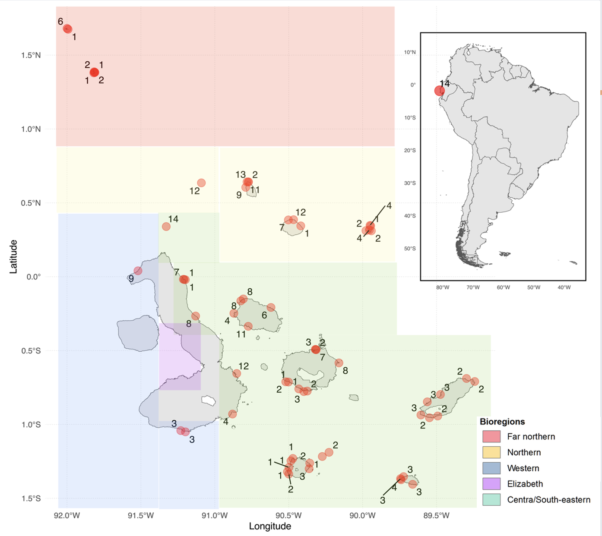

## 1. SNP calling

- All 210 samples WGS at ~25x

- Sequence data processed with SnpArcher pipeline with the following
  [sample table](Data/sample_210.csv),
  [config.yaml](Data/snparcher_config.yaml) and
  [config_slurm.yaml](Data/slurm_config.yaml)

``` bash
#Ref genome path
/lustre1/home2/nt246_0001/jdo53/New_Assembly/FCS/CU_Ifusc_2_1.fasta

#Subset only to the 23 chromosomes for snpArcher pipeline
/programs/seqkit-0.15.0/seqkit grep -r -p "Chr0[1-9]|Chr1[0-9]|Chr2[0-3]" /lustre1/home2/nt246_0001/jdo53/New_Assembly/FCS/CU_Ifusc_2_1.fasta > /lustre1/home2/nt246_0001/jdo53/New_Assembly/FCS/CU_Ifusc_2_1_subset_23Chroms.fasta


# Run sparcher form login node in BioHPC
## Activate the snparcher mamba env
source $HOME/miniforge3/bin/activate snparcher

## Run the snakemake command (including flags in case the run fails partway through to not regenerate existing files)
snakemake -s /home2/jdo53/snpArcher/workflow/Snakefile -d /home2/jdo53/snpArcher_Projects/snpArcher_CU_Ifusc_2_1 --rerun-trigger mtime --rerun-incomplete --workflow-profile /home2/jdo53/snpArcher_Projects/snpArcher_CU_Ifusc_2_1/profiles/slurm --conda-prefix /lustre1/home2/nt246_0001/jdo53/snpArcher_Projects/full_210_samples/.snakemake/conda --max-status-checks-per-second 5 -n
```

- 88 million SNPs were discovered before any filters were applied.

- The GATK best practices filters (removing all indels, non-biallelic
  SNPs, SNPs with a minor allele frequency \< 0.01, SNPs with \>75%
  missing data, and samples with \<2x sequencing depth) were then
  applied leaving **74407954 SNPs**.

- The approximate nucleotide diversity in the sample using the Watterson
  estimator is 1.3%.

- The quality control analysis from SnpArcher considers randomly
  selected SNPs within a set window size to end up with approximately
  100k SNPs (in this QC report, 100199). These are effectively an LD
  pruned set of SNPs. All analyses in this report are based on this set
  of 100k SNPs.

[SnpArcher QC analyses](Data/cuc_2_1_qc.html) revealed two outliers
(samples 57 and 127) that correspond to unique color-morph individuals
from the northern region of the Archipelago (red and black; first record
of these color morphs for the Galapagos). We corroborated species
identity of these two outliers by extracting the COI and BLAST, which
called the right species *I. fuscus* with 99.66% identity.


## 2. PCA (full data: 27006852 SNPs)

- After removing the two outlier samples (57 and 127) the PCA plot
  showed three clusters. However these clusters do not follow any
  geographical or environmental pattern. There is a substantial amount
  of genetic variance partitioning among these clusters.

  ``` bash
  #1 filter samples 57 and 127
  bcftools view -s ^GAL-127,GAL-057 /lustre1/home2/nt246_0001/jdo53/snpArcher_Projects/snpArcher_CU_Ifusc_2_1/results/CU_Ifusc_2_1_subset_23Chroms/cuc_2_1_clean_snps.vcf.gz -Oz -o /lustre1/home2/nt246_0001/jdo53/CU_Ifusc_2_1_Analyses/PCA/CU_Ifusc_2_1_filtered_57_127_snps.vcf.gz

  # Step 2: Convert filtered VCF to PLINK format, Assign unique IDs including alleles
  /programs/plink2_linux_avx2_20230721/plink2 --vcf CU_Ifusc_2_1_filtered_57_127_snps.vcf.gz --allow-extra-chr --autosome-num 95 --make-bed --set-all-var-ids @:#:\$r,\$a --out CU_Ifusc_2_1_filtered_57_127_polymorphic_snp_plink


  # Step 3: Run PCA on filtered and biallelic only data
  /programs/plink2_linux_avx2_20230721/plink2 --bfile CU_Ifusc_2_1_filtered_57_127_polymorphic_snp_plink_dedup \
        --make-bed \
        --allow-extra-chr --autosome-num 95 \
        --pca allele-wts \
        --out CU_Ifusc_2_1_filtered_57_127_polymorphic_snp_pca_results
  ```

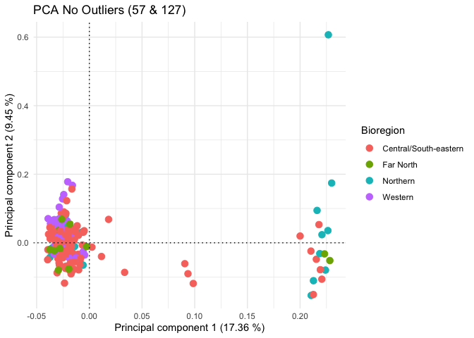

- PC 1 explains 9.12% of variance.

- H: This pattern could be driven by sex determination loci.

- PCA per chromosome do not show a desirnable pattern either (plots in
  folder: [PCA_Chroms](./PCA_Chroms)).

- PCA analysis per Island also show similar clustering pattern of the
  global PCA (3 clusters).


## 3. PCA Loadings (full data)

- Strong loadings in many different chromosomes and concentrated across
  various chromosomes (genome wide effect)

- The first plot shows the raw loadings, and the second plot shows the
  Squared loadings. To facilitate the visualization, the second plot
  contain only the top 0.1% SNPs, and the 100 top-ranked SNPs are
  colored in red. The loadings were calculated using PLINK2 PCA command
  with the following settings `--pca allele-wts` and I filtered out the
  outlier samples (57 and 127).

``` r
# Read SNP loadings for PC1
# snp_loadings <- fread("Data/CU_Ifusc_2_1_filtered_57_127_biallelic_snp_pca_results.eigenvec.var", header = TRUE) |>
#   select(`#CHROM`,ID,PC1) |>
#   mutate(PC1_sqrd = PC1^2)
# # 
# # #prepare data
# data <- snp_loadings %>%
#   filter(is.finite(PC1_sqrd)) %>%
#   mutate(Rank_unique = dense_rank(desc(PC1_sqrd))) %>%  # 1 = highest value; ties share rank, many loadings are similar
#   mutate(
#     Top_100 = Rank_unique <= 100,
#     Top_0_1_Percent = row_number(desc(PC1_sqrd)) <= ceiling(0.001 * n())
#   ) %>%
#   arrange(Rank_unique, desc(PC1_sqrd)) %>%
#   filter(Top_0_1_Percent) %>% # Filter for top-ranked SNPs (top 0.1%)
#   mutate(POS = sub("^[^:]*:([^:]+).*", "\\1", ID)) # position from your ID field
# # 
# # #save clean DF
# write_csv(data,"Data/top_snps_0_1.csv")
# 
# #save top_SNPs IDs for furhter PLINK analyses
# top_snps <- unique(data$ID)
# 
# # Write SNP list for PLINK2 extraction
# write.table(top_snps, file="top0.1pct_snps.txt", 
#             quote=FALSE, row.names=FALSE, col.names=FALSE)

#load data
top_snps_1 <- read_csv("Data/top_snps_0_1.csv",show_col_types = FALSE)

# 1) Normalize minimal types, compute offsets once, cumulative position, and axis centers
genome_df <- top_snps_1 %>%
  transmute(
    CHR_NUM = as.integer(`#CHROM`),           # keep numbers as provided (non-human allowed)
    POS     = as.numeric(POS),                  
    PC1,
    PC1_sqrd,
    Top_100 = as.logical(Top_100)
  ) %>%
  filter(!is.na(CHR_NUM), !is.na(POS)) %>%
  arrange(CHR_NUM, POS)

chr_info <- genome_df %>%
  group_by(CHR_NUM) %>%
  summarise(chr_len = max(POS, na.rm = TRUE), .groups = "drop") %>%
  arrange(CHR_NUM) %>%
  mutate(offset = lag(cumsum(chr_len), default = 0))

df_cum <- genome_df %>%
  left_join(chr_info, by = "CHR_NUM") %>%
  mutate(
    pos_cum  = POS + offset,
    bg_group = CHR_NUM %% 2           # alternate two colors by chromosome
  )

axis_df <- df_cum %>%
  group_by(CHR_NUM) %>%
  summarise(center = (min(pos_cum) + max(pos_cum)) / 2, .groups = "drop")

# 2) Plot PC1 along genome (alternating grey/blue)
p_pc1 <- ggplot(df_cum, aes(x = pos_cum, y = PC1)) +
  geom_point(aes(color = factor(bg_group)), alpha = 0.6, size = 0.2, show.legend = FALSE) +
  scale_color_manual(values = c("0" = "grey70", "1" = "#2C7FB8")) +
  scale_x_continuous(breaks = axis_df$center, labels = axis_df$CHR_NUM,
                     expand = expansion(mult = c(0.001, 0.01))) +
  labs(title = "Genome-wide SNP subset of 0.1% loadings for PC1 (N=54014)",
       x = "Chromosomes", y = "PC1 loading") +
  theme_minimal(base_size = 11) +
  theme(panel.grid.major.x = element_blank(),
        panel.grid.minor.x = element_blank())

p_pc1
```

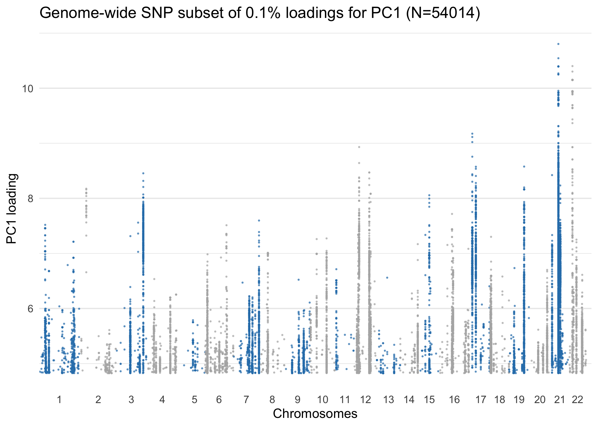

``` r
# 3) Manhattan of squared loadings with Top_100 in red and a simple legend
p_sq <- ggplot(df_cum, aes(x = pos_cum, y = PC1_sqrd)) +
  geom_point(aes(color = factor(bg_group)), alpha = 0.5, size = 1.2, show.legend = FALSE) +
  scale_color_manual(values = c("0" = "grey70", "1" = "#2C7FB8"), guide = "none") +
  geom_point(
    data = dplyr::filter(df_cum, Top_100),
    aes(shape = "Top 100 loadings"),
    color = "red3", alpha = 0.9, size = 1.6, show.legend = TRUE
  ) +
  scale_shape_manual(
    values = c("Top 100 loadings" = 16),
    breaks = "Top 100 loadings",
    name = NULL,
    guide = guide_legend(override.aes = list(color = "red3", size = 3))
  ) +
  scale_x_continuous(breaks = axis_df$center, labels = axis_df$CHR_NUM,
                     expand = expansion(mult = c(0.001, 0.01))) +
  labs(title = "Squared loadings subset of 0.1% loadings for PC1 (N=54014)",
       x = "Chromosomes",
       y = expression(Squared ~ loadings ~ rho[j]^2)) +
  theme_minimal(base_size = 11) +
  theme(panel.grid.major.x = element_blank(),
        panel.grid.minor.x = element_blank(),
        legend.position = "top")

p_sq
```


## 4. Mitochondrial haplotype network

To investigate the pattern observed in the PCA analysis we extracted the
reads mapping to the mitogenome and generated a haplotype network.

1.  Map reads from fastq files to the reference mitogenome (fasta): To
    map the fastq files to the reference mitogenome we implemented our
    own snakemake pipeline (`Snakefile_mtDNA.smk`). The snakemake file
    and the corresponding configuration file can be found in the
    `scripts` folder. The pipeline outputs a fasta file for each sample.

2.  Align mitogenome sequences: We aligned each of the fasta files using
    MEGA11 to produce a Nexus file for network analysis in the software
    `popart.`

3.  Haplotype network analysis: We used `popart` with the `TCS Network`
    algortihm for haplotype network analysis using the aligned sequences
    in nexus format and a traits table to color the network nodes per
    PCA cluster. The nexus file and traits table can be found in the
    `Data` folder.

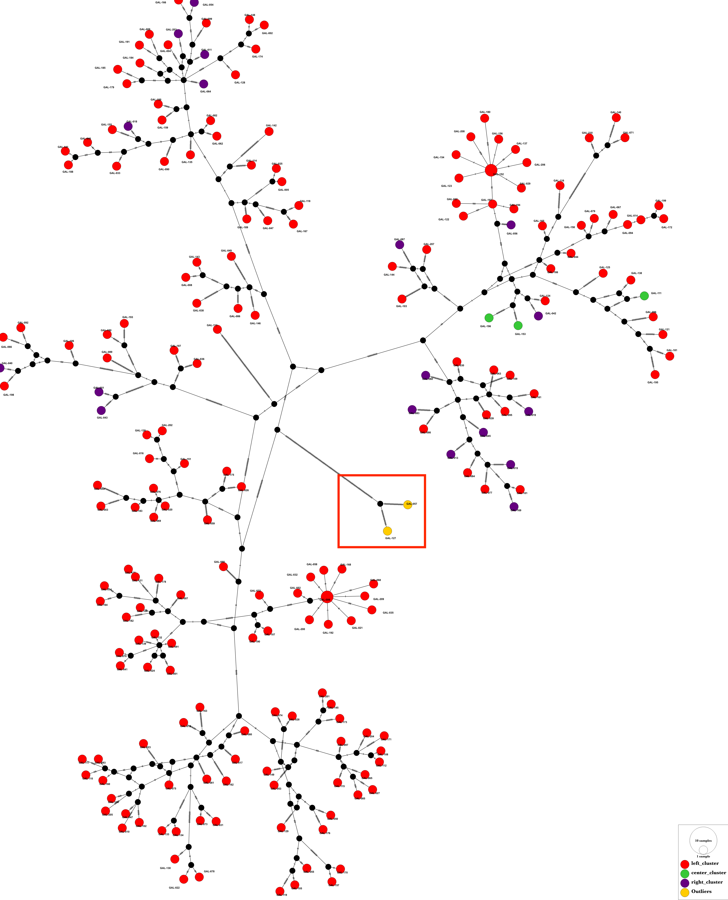

- The mitogenome haplotype network does not show a clear separation of
  haplotypes by PCA clustering. However, it is interesting to observe
  that the outlier samples (yellow circles within the red square;
  samples 57 and 127) are mapped together and showed a high divergence
  in comparison to the other samples.

## 5. SNP density per Chromosome (50Kb windows - full data)

``` r
suppressPackageStartupMessages({
  library(data.table)
  library(dplyr)
  library(ggplot2)
  library(scales)
  library(grid)
})

# 1) Read BED with window counts
bed_file <- "Data/snp_density_50kb.bed"  # chrom  start  end  count

dens <- fread(bed_file, col.names = c("chrom","start","end","count"),
              na.strings = c(".", "NA", "")) %>%
  mutate(
    chrom = as.character(chrom),
    start = as.numeric(start),
    end   = as.numeric(end),
    count = as.numeric(count)
  )

# Replace missing counts with 0 and clean rows
dens$count[is.na(dens$count)] <- 0
dens <- dens %>% filter(!is.na(chrom), !is.na(start), !is.na(end), end > start)

# Aggregate duplicate windows, if any
dens <- dens %>%
  group_by(chrom, start, end) %>%
  summarise(count = sum(count, na.rm = TRUE), .groups = "drop")

# Midpoints and Mb coordinates
dens <- dens %>%
  mutate(
    mid_Mb = (start + end)/2 / 1e6,
    xminMb = start/1e6,
    xmaxMb = end/1e6
  )

# Global x range (same for all facets)
x_min <- 0
x_max <- max(dens$xmaxMb, na.rm = TRUE)

# Keep chromosome order as in file
chrom_levels <- unique(dens$chrom)
dens$chrom <- factor(dens$chrom, levels = chrom_levels)

# 2A) Plot as rectangles (recommended for dense windows)
p_rect <- ggplot(dens) +
  geom_rect(
    aes(xmin = xminMb, xmax = xmaxMb, ymin = 0, ymax = count),
    fill = "#5A8DCB", color = NA
  ) +
  facet_grid(chrom~., scales = "free_y") +   # FIXED x, free y
  scale_x_continuous(limits = c(x_min, x_max), expand = c(0, 0),
                     breaks = pretty_breaks(n = 6)) +
  labs(
    title = "SNP Density Across Chromosomes (50 kb windows)",
    x = "Chromosomal Position (Mb)",
    y = "SNP Count"
  ) +
  theme_minimal(base_size = 11) +
  theme(
    panel.grid.minor = element_blank(),
    panel.grid.major.x = element_blank(),
    strip.text = element_text(face = "bold"),
    panel.spacing.y = unit(0.12, "lines")
  )

p_rect
```

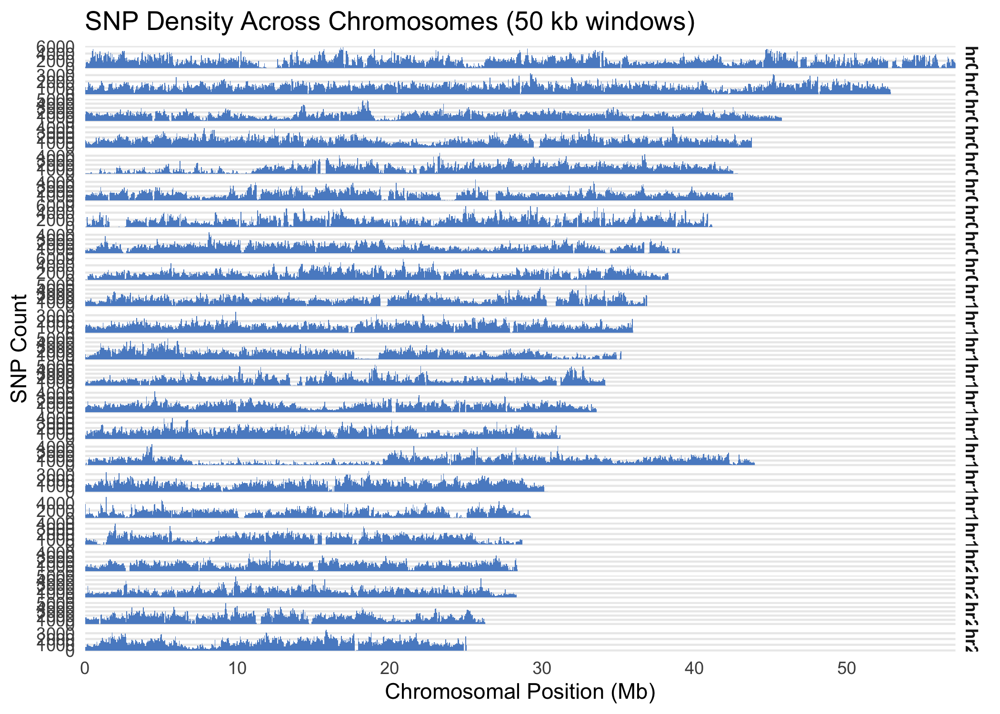

## 6. SNP prunning (Full data)

``` bash
#Workdir
/lustre1/home2/nt246_0001/jdo53/CU_Ifusc_2_1_Analyses/PCA_subsampled_data

#VCF file
/lustre1/home2/nt246_0001/jdo53/CU_Ifusc_2_1_Analyses/PCA/CU_Ifusc_2_1_filtered_57_127_snps.vcf.gz

#PLINK2 formatted VCF file (27006852 variants)
/lustre1/home2/nt246_0001/jdo53/CU_Ifusc_2_1_Analyses/PCA/CU_Ifusc_2_1_filtered_57_127_polymorphic_snp_plink

# Subsample SNPs to retain 1 SNP per 50 Kb

/programs/plink2_linux_avx2_20230721/plink2 --bfile /lustre1/home2/nt246_0001/jdo53/CU_Ifusc_2_1_Analyses/PCA/CU_Ifusc_2_1_filtered_57_127_polymorphic_snp_plink \
       --bp-space 50000 \
       --allow-extra-chr \
       --make-bed --out subsampled_filtered_sorted_s57_s127_snps
#16816 remaining

# Run PCA on PLINK filtered data
/programs/plink2_linux_avx2_20230721/plink2 --bfile subsampled_filtered_sorted_s57_s127_snps --pca 10 --allow-extra-chr --out pca_subsampled_plink2_s57_s127_snps
       
 #Use bcftools to subsample
 
#bcftools keep only 551 SNPs

bcftools +prune \
    --nsites-per-win 1 \
    --nsites-per-win-mode 1st \
    -w 50000 \
    -Oz \
    -o pruned_50Kb_filtered_sorted_s57_s127_snps.vcf.gz \
    filtered_sorted_s57_s127_snps.vcf.gz


#check number of SNPs
bcftools view -H pruned_50Kb_filtered_sorted_s57_s127_snps.vcf.gz | wc -l
#551 SNPs


#Convert BCFTOOLS filtered VCF to PLINK format
/programs/plink2_linux_avx2_20230721/plink2 --vcf pruned_50Kb_filtered_sorted_s57_s127_snps.vcf.gz --allow-extra-chr --autosome-num 95 --make-bed --out pruned_bcftools50Kb_s57_s127_snps

#Run PCA on BCFTOOLS filtered data
/programs/plink2_linux_avx2_20230721/plink2 --bfile pruned_bcftools50Kb_s57_s127_snps --pca 10 --allow-extra-chr --autosome-num 95 --out pruned_bcftools50Kb_s57_s127_snps_pca
```

``` r
#######PCA BCFTOOLS Pruned 50Kb ##########
library(readr)
# read in result files
eigenValues_bcf <- read_delim("Data/random_bcftools50Kb_filtered_sorted_s57_s127_snps_pca.eigenval", delim = " ", col_names = F)
```

    Rows: 10 Columns: 1
    ── Column specification ────────────────────────────────────────────────────────
    Delimiter: " "
    dbl (1): X1

    ℹ Use `spec()` to retrieve the full column specification for this data.
    ℹ Specify the column types or set `show_col_types = FALSE` to quiet this message.

``` r
eigenVectors_bcf <- read_delim("Data/random_bcftools50Kb_filtered_sorted_s57_s127_snps_pca.eigenvec", delim = "\t", col_names = T)
```

    Rows: 208 Columns: 12
    ── Column specification ────────────────────────────────────────────────────────
    Delimiter: "\t"
    chr  (1): IID
    dbl (11): #FID, PC1, PC2, PC3, PC4, PC5, PC6, PC7, PC8, PC9, PC10

    ℹ Use `spec()` to retrieve the full column specification for this data.
    ℹ Specify the column types or set `show_col_types = FALSE` to quiet this message.

``` r
## Proportion of variation captured by each vector
eigen_percent_bcf <- round((eigenValues_bcf / (sum(eigenValues_bcf))*100), 2)

eigen_env_bcf <- left_join(eigenVectors_bcf, env_data, by = "IID")

#write_csv(eigenVectors, "pruned_bcftools50Kb_filtered_sorted_s57_s127_snps_pca.csv")

# PCA plot
ggplot(data = eigen_env_bcf,mapping = aes(x = PC1, y = PC2, color = Bioregion)) +
    geom_point(size = 3, show.legend = T ) +
    geom_hline(yintercept = 0, linetype="dotted") +
    #geom_text(hjust=0, vjust=0, aes(label=`#IID`)) +
    geom_vline(xintercept = 0, linetype="dotted") +
    theme(legend.position="right") +
    labs(title = "Subsampled bcftools W-50Kb (551 SNPs)",
         x = paste0("Principal component 1 (",eigen_percent_bcf[1,1]," %)"),
         y = paste0("Principal component 2 (",eigen_percent_bcf[2,1]," %)"))+ #,
    #colour = "Goat breeds", shape = "Goat breeds") +
    theme_minimal()
```

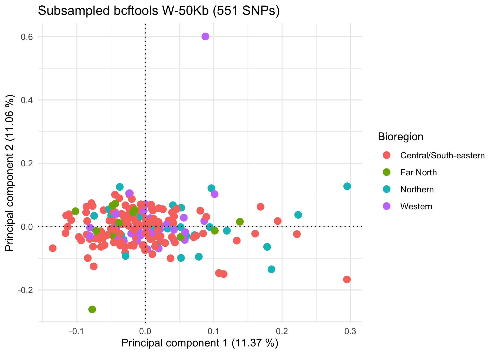

- Bcftools does a genome-wide pruning with 50kb windows and keeps a
  random SNP. Heavily reduced the number of SNPs (N = 551), initial
  clustering pattern disappears.

  ``` r
  #######PCA PLINK2 Pruned 50Kb ##########
  library(readr)
  # read in result files
  eigenValues <- read_delim("Data/pca_subsampled_plink2_s57_s127_snps.eigenval", delim = " ", col_names = F)
  ```

      Rows: 10 Columns: 1
      ── Column specification ────────────────────────────────────────────────────────
      Delimiter: " "
      dbl (1): X1

      ℹ Use `spec()` to retrieve the full column specification for this data.
      ℹ Specify the column types or set `show_col_types = FALSE` to quiet this message.

  ``` r
  eigenVectors <- read_delim("Data/pca_subsampled_plink2_s57_s127_snps.eigenvec", delim = "\t", col_names = T)
  ```

      Rows: 208 Columns: 12
      ── Column specification ────────────────────────────────────────────────────────
      Delimiter: "\t"
      chr  (1): IID
      dbl (11): #FID, PC1, PC2, PC3, PC4, PC5, PC6, PC7, PC8, PC9, PC10

      ℹ Use `spec()` to retrieve the full column specification for this data.
      ℹ Specify the column types or set `show_col_types = FALSE` to quiet this message.

  ``` r
  ## Proportion of variation captured by each vector
  eigen_percent <- round((eigenValues / (sum(eigenValues))*100), 2)

  env_data <- read_csv("./Data/env_data.csv")
  ```

      Rows: 208 Columns: 12
      ── Column specification ────────────────────────────────────────────────────────
      Delimiter: ","
      chr (6): IID, isla, tipo_fondo, Macrozona, Bioregion, Region
      dbl (6): tubo, GPS_lat, GPS_lon, longitud_cm, Temperatura_fondo, profundidad_m

      ℹ Use `spec()` to retrieve the full column specification for this data.
      ℹ Specify the column types or set `show_col_types = FALSE` to quiet this message.

  ``` r
  eigen_env <- left_join(eigenVectors, env_data, by = "IID")


  #write_csv(eigenVectors, "subsampled_plink2_filtered_sorted_s57_s127_snps_pca.csv")

  # PCA plot
  ggplot(data = eigen_env,mapping = aes(x = PC1, y = PC2, color = Bioregion)) +
      geom_point(size = 3, show.legend = T ) +
      geom_hline(yintercept = 0, linetype="dotted") +
      #geom_text(hjust=0, vjust=0, aes(label=`#IID`)) +
      geom_vline(xintercept = 0, linetype="dotted") +
      theme(legend.position="right") +
      labs(title = "Subsampled PLINK2 W-50Kb (16816 SNPs)",
           x = paste0("Principal component 1 (",eigen_percent[1,1]," %)"),
           y = paste0("Principal component 2 (",eigen_percent[2,1]," %)"))+ #,
      #colour = "Goat breeds", shape = "Goat breeds") +
      theme_minimal()
  ```

  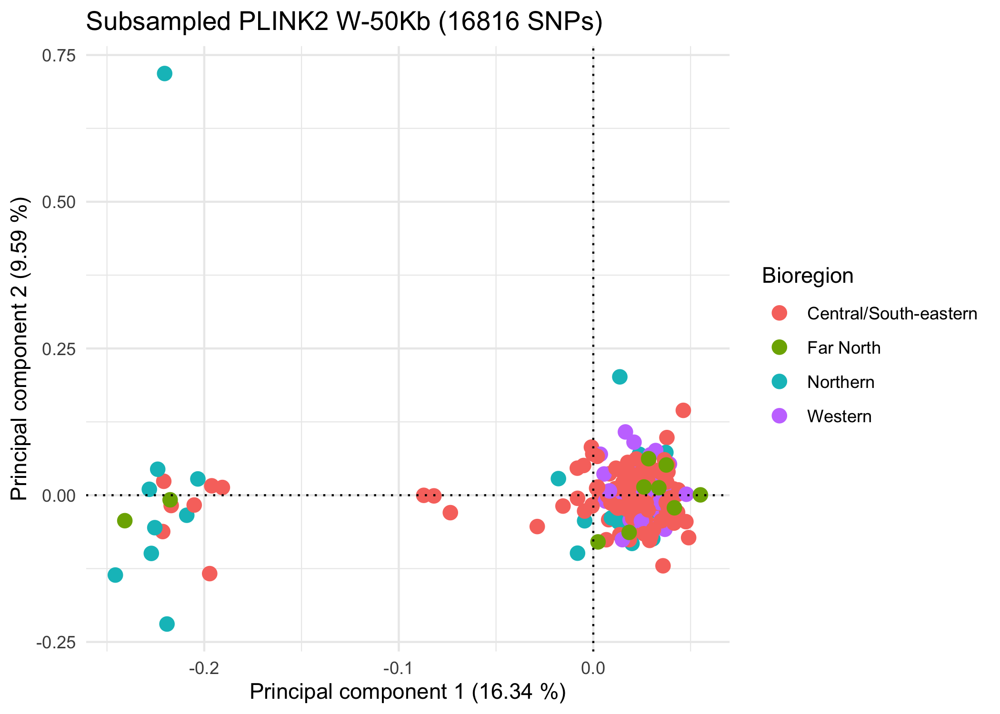

- PLINK2 prunes on each chromosome and maintains an SNP even if the
  chromosome is smaller than 50Kb (SNPs = 16816). More SNPs maintain
  cluster pattern.

## 7. LcWGS

- To check for library prep errors, we selected a subset of samples to
  perform LcWGS. PCA plots show similar clustering pattern, confirming
  that WGS library prep was not contaminated.

  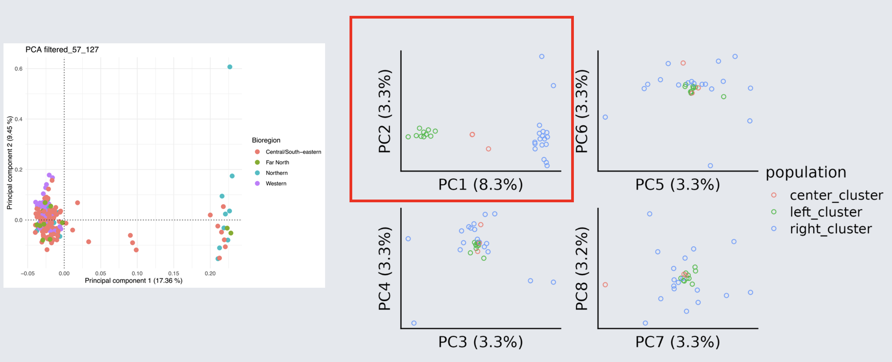

## 8. LD Analysis

- Genome-wide LD analysis. LD was calculated for 0.1% of the top-loading
  SNPs (N = 7049).


- Strong LD is observed among the SNPs on each chromosome.

- The cross-chromosome LD observed in high-loading SNPs is higher than
  random genome-wide background

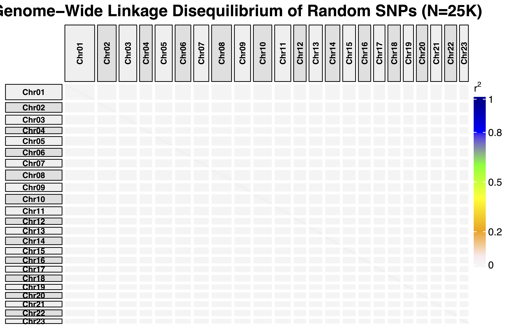

## 9. Observed Heterozygosity

``` r
#Pop info = Cluster from Global PCA (Left, Center, Right)
pop_info <- fread("Data/sample_population_info.txt")


# Load data
geno <- read.table("Data/HighLoad_01pct_genotypes.tsv", header=F, stringsAsFactors=FALSE) 
colnames(geno) <- c("CHROM", "POS", as.character(pop_info$ID))
geno <- geno |> 
    mutate(CHROM = str_extract(CHROM, '^[^_]+'))


# Reshape to long format
geno_long <- geno %>%
    pivot_longer(
        cols = -c(CHROM, POS),
        names_to = "ID",
        values_to = "GT"
    )

# Join population info
geno_long <- geno_long %>% left_join(pop_info, by = "ID")

# Define heterozygous genotypes
is_het <- function(gt) grepl("0[|/]1|1[|/]0", gt)
geno_long$HET <- sapply(geno_long$GT, is_het)

# Calculate per-individual heterozygosity
ind_het <- geno_long %>%
    group_by(ID, Cluster) %>%
    summarise(multi_locus_het = mean(HET, na.rm=TRUE), .groups = "drop")

#write_csv(ind_het,"ind_het.csv")

ggplot(ind_het, aes(x = Cluster, y = multi_locus_het, fill = Cluster)) +
    geom_boxplot(outlier.shape = NA, alpha = 0.7) +
    geom_jitter(width = 0.2, size = 2, alpha = 0.7) +
    theme_minimal(base_size = 14) +
    labs(
        title = "Individual Multi-locus Heterozygosity by Cluster",
        x = "Cluster",
        y = "Multi-locus heterozygosity"
    ) +
    theme(
        axis.text.x = element_text(angle = 45, hjust = 1),
        legend.position = "none"
    )
```

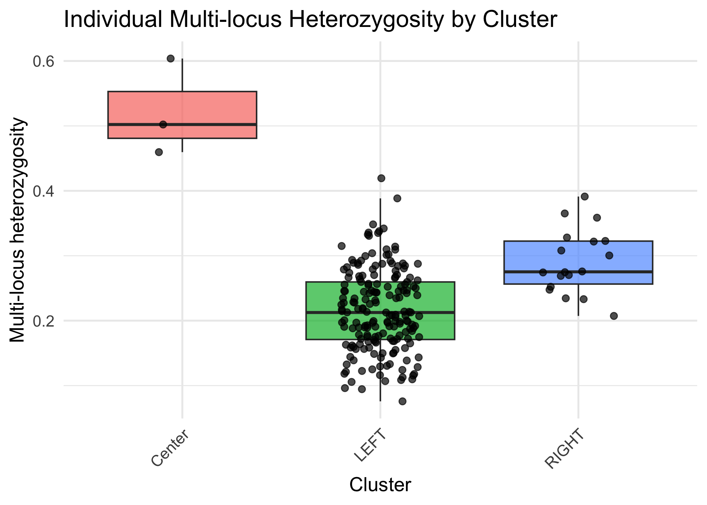

- Results for the observed heterozygosity at each cluster for the
  high-loading SNPs, shows the highest heterozygosity observed in the
  central cluster (possibly hermaphrodites) . Which, in case the
  sex-driven hypothesis is true, aligns well with the logic that high
  heterozygosity levels reflect the need to maintain genetic variation
  for both male and female reproductive functions.

### 9.1 Per SNP-Heterozygosity difference between Left and Right clusters

``` r
# Calculate per-site heterozygosity for each cluster
het_by_cluster <- geno_long %>%
    group_by(CHROM, POS, Cluster) %>%
    summarise(
        HET = sum(HET, na.rm = TRUE) / sum(!is.na(GT) & GT != "./." & GT != ".", na.rm = TRUE),
        .groups = "drop"
    )


#Convert to wide format so each row is a SNP and each cluster is a column:
    
het_wide <- het_by_cluster %>%
    pivot_wider(names_from = Cluster, values_from = HET)

# Calculate difference (e.g., left - right)
het_wide <- het_wide %>%
    mutate(diff_left_right = LEFT - RIGHT)

ggplot(het_wide, aes(x = POS, y = diff_left_right)) +
    geom_point(aes(color = diff_left_right < 0), size = 0.5, alpha = 0.7) +
    facet_wrap(~CHROM, scales = "free_x") +
    geom_hline(yintercept = 0, linetype = "dotted", color = "red") +
    scale_color_manual(values = c("black", "blue"), guide = "none") +
    labs(
        x = "Genomic Position",
        y = "Heterozygosity Difference",
        title = "Per-Site Heterozygosity Difference (Left - Right) by Chromosome"
    ) +
    theme_bw() +
    theme(axis.text.x = element_text(size = 5))
```

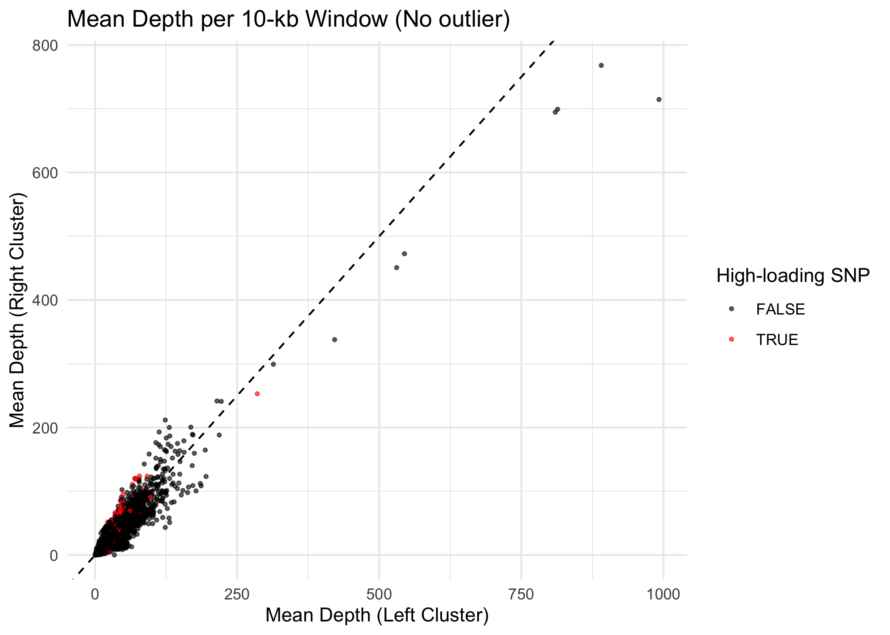

- Results show that the right cluster has more heterozygous SNPs than
  the left cluster.

``` r
# Remove rows with NA in left or right
het_wide_filtered <- het_wide %>% filter(!is.na(LEFT) & !is.na(RIGHT))

# Scatter plot: left vs right cluster heterozygosity, faceted by chromosome
ggplot(het_wide_filtered, aes(x = LEFT, y = RIGHT)) +
  geom_point(alpha = 0.5, size = 0.7) +
  facet_wrap(~CHROM) +
  geom_abline(slope = 1, intercept = 0, linetype = "dashed", color = "red") +
  scale_x_continuous(limits = c(0, 1)) +
  scale_y_continuous(limits = c(0, 1)) +
  #coord_fixed(ratio = 1) +
  labs(
    x = "Per-SNP Heterozygosity in Left Cluster",
    y = "Per-SNP Heterozygosity in Right Cluster",
    title = "Per-SNP Heterozygosity: Left vs Right Cluster by Chromosome"
  ) +
  theme_bw()
```

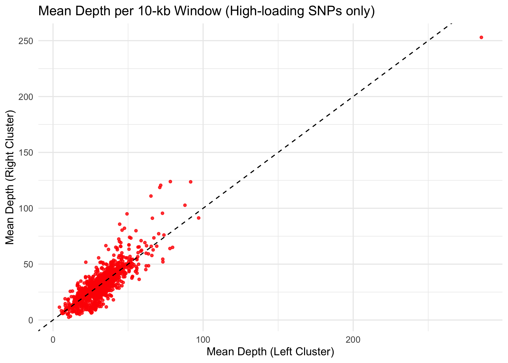

- Chromosomes 6 and 9 show distinct patterns.

## 10. Mean Depth per Site (VCF)

``` r
# Read the depth data from vcftools
depth_data <- fread("Data/depth_analysis_snps_01pct.gdepth")

# Get individual column names (skip CHROM and POS)
individual_cols <- colnames(depth_data)[3:ncol(depth_data)]

# Reshape to long format and join with population info
depth_processed <- depth_data %>%
  pivot_longer(
    cols = all_of(individual_cols),
    names_to = "ID", 
    values_to = "DEPTH"
  ) %>%
  filter(DEPTH >= 0) %>%  # Remove missing values (-1)
  left_join(pop_info, by = "ID") %>%
  filter(Cluster %in% c("LEFT", "RIGHT"))  # Keep only LEFT and RIGHT

# Calculate mean depth per site per population
site_depth_summary <- depth_processed %>%
  group_by(CHROM, POS, Cluster) %>%
  summarise(MEAN_DEPTH = mean(DEPTH, na.rm = TRUE),
            LENGTH = max(POS),
            .groups = "drop")

# Calculate scaffold lengths and mean depth per scaffold
scaffold_data <- site_depth_summary %>%
  group_by(CHROM, Cluster) %>%
  summarise(
    MEAN_DEPTH = mean(MEAN_DEPTH, na.rm = TRUE),
    LENGTH = max(POS),
    .groups = "drop"
  )

# Calculate mean depth by population
mean_depth_by_pop <- site_depth_summary %>%
  group_by(Cluster) %>%
  summarise(mean_depth = mean(MEAN_DEPTH, na.rm = TRUE), .groups = "drop")

# Create the plot (exactly like your attached figure)
ggplot(site_depth_summary, aes(x = LENGTH, y = MEAN_DEPTH, color = Cluster)) +
  geom_point(alpha = 0.7, size = 0.8) +
  geom_hline(data = mean_depth_by_pop, aes(yintercept = mean_depth, color = Cluster),
             linetype = "dashed", linewidth = 1) +
  scale_x_continuous(
    name = "Scaffold Length (bp)",
    labels = scales::scientific
  ) +
  scale_y_continuous(name = "Mean Depth per Site") +
  scale_color_manual(
    values = c("LEFT" = "#E69F00", "RIGHT" = "#56B4E9"),
    name = "Cluster"
  ) +
  theme_minimal() +
  theme(legend.position = "top") +
  labs(title = "Mean Depth per Site by Cluster")
```


- The mean number of reads per site across a scaffold did not differ
  significantly with scaffold length in either cluster.
- However, there is a peak of elevated coverage =\> could indicate
  repetitive elements or duplicates.

# 11. Per-site depth (raw reads - BAM files)

Here we calculate the mean per-site depth on 10Kb windows across the
genome using the unfiltered BAM files as input.

We used `bedtools` to partition the genome in 10Kb windows and calculate
the mean per-site depth.

``` bash
#BAM files
/home2/jdo53/snpArcher_Projects/snpArcher_New_Assembly/results/final_assembly_23_scaffold/bams

samtools view GAL-001_final.bam | head

#Ref FASTA
/home2/jdo53/snpArcher_Projects/snpArcher_New_Assembly/final_assembly_23_scaffold.fasta

#1. Generate genome file (Chromosome sizes)
samtools faidx final_assembly_23_scaffold.fasta
cut -f1,2 final_assembly_23_scaffold.fasta.fai > final_assembly_genome.txt

#2. Create 10Kb windows
bedtools makewindows -g final_assembly_genome.txt -w 10000 > final_assembly_genome_10kb_windows.bed
#Output columns: CHR, start, end

#3. Extract Per-Window Depth for Each BAM File
for bam in /home2/jdo53/snpArcher_Projects/snpArcher_New_Assembly/results/final_assembly_23_scaffold/bams/*.bam; do
  sample=$(basename $bam .bam)
  bedtools coverage -a final_assembly_genome_10kb_windows.bed -b $bam -mean > ${sample}.depth.bed
done
```

Data processing of per sample `depth.bed` files and plotting

``` r
##DATA PREPROCESSING
#The following code requires that all depth.bed files for each sample are in a folder.
#A table that contains the samples names/ID and population (in this case = Cluster).
#A bed file that contains the information of the high loading SNPs.
#Note: Since the depth.bed files are large this code is read only.

library(tidyverse)

# Load the cluster table (tab- or csv-separated as appropriate)
cluster_table <- read_tsv("sample_cluster_table.txt")
# Extract IDs for each cluster
left_ids  <- cluster_table$ID[cluster_table$Cluster == "LEFT"]
right_ids <- cluster_table$ID[cluster_table$Cluster == "RIGHT"]

# These ID vectors will be used to aggregate per-cluster coverage

# Helper: read all sample depth files and give each a unique column header
get_depth_dfs <- function(ids) {
  depth_files <- paste0("Depth_Bed/",ids, "_final.depth.bed")
  # Map file to ID so each column is named for its sample
  map2(depth_files, ids, ~read_tsv(.x, col_names = c("chr", "start", "end", .y)))
}

# Merge all by genomic window (chr, start, end)
merge_depths <- function(depth_dfs) {
  reduce(depth_dfs, left_join, by = c("chr", "start", "end"))
}

# Calculate per-window mean for the cluster
compute_cluster_mean <- function(merged_df, n_samples) {
  sample_cols <- (ncol(merged_df) - n_samples + 1):ncol(merged_df)
  merged_df %>%
    mutate(cluster_mean = rowMeans(select(., all_of(sample_cols)), na.rm = TRUE))
}

#left cluster
left_depth_dfs <- get_depth_dfs(left_ids)
left_merged <- merge_depths(left_depth_dfs)
left_cluster <- compute_cluster_mean(left_merged, length(left_ids)) %>%
  select(chr, start, end, left_cluster_mean = cluster_mean)

#right cluster
right_depth_dfs <- get_depth_dfs(right_ids)
right_merged <- merge_depths(right_depth_dfs)
right_cluster <- compute_cluster_mean(right_merged, length(right_ids)) %>%
  select(chr, start, end, right_cluster_mean = cluster_mean)

#combine
windows_agg <- left_join(left_cluster, right_cluster, by = c("chr", "start", "end"))
# Now each row is a window, with left/right cluster means

# Read BED of windows with high-loading SNPs
windows_snps <- read_tsv("windows_with_snps.bed", col_names = c("chr", "start", "end"))
#write_csv(windows_snps, "windows_snps.csv")

# Add a logical column indicating SNP presence to the table
windows_agg <- windows_agg %>%
  mutate(high_loading_window = paste(chr, start, end) %in%
           paste(windows_snps$chr, windows_snps$start, windows_snps$end))

#write_csv(windows_agg, "windows_agg.csv")
```

``` r
##BAM - MEAN PER_SITE DEPTH ANALYSIS 
#This code requires a csv file of the preprocessed depth.bed files (see code above).

windows_agg <- read_csv("Data/windows_agg.csv")
```

    Rows: 85106 Columns: 6
    ── Column specification ────────────────────────────────────────────────────────
    Delimiter: ","
    chr (1): chr
    dbl (4): start, end, left_cluster_mean, right_cluster_mean
    lgl (1): high_loading_window

    ℹ Use `spec()` to retrieve the full column specification for this data.
    ℹ Specify the column types or set `show_col_types = FALSE` to quiet this message.

``` r
#X-Y scatter plot of Right cluster vs Left cluster per-site mean depth 10Kb windows
#Left cluster contains 187 sambles
#Right cluster contains 18 samples

windows_agg |>
ggplot(aes(x = left_cluster_mean, y = right_cluster_mean, color = high_loading_window)) +
  geom_point(alpha = 0.6, size = 0.7) +
  labs(
    x = "Mean Depth (Left Cluster)", 
    y = "Mean Depth (Right Cluster)",
    title = "Mean Depth per 10-kb Window"
  ) +
  geom_abline(slope = 1, intercept = 0, linetype = "dashed") +
  scale_color_manual(values = c("black", "red"), name = "High-loading SNP") +
  theme_minimal()
```

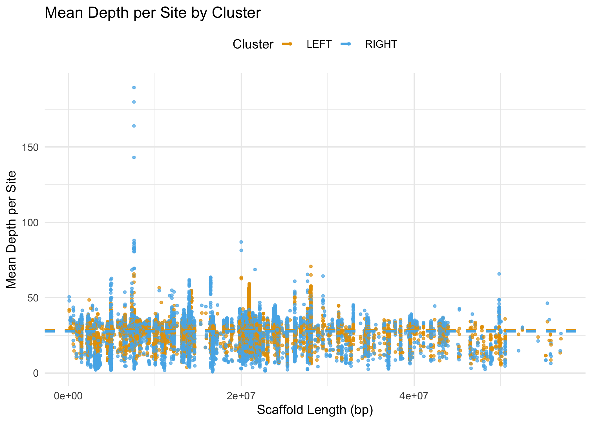

- There is an outlier point that does not correspond to a high loading
  window and located in Chr20.

- We will filter out this outlier to better visualize the scatter plot.

``` r
windows_agg |> filter(left_cluster_mean < 10000) |>
ggplot(aes(x = left_cluster_mean, y = right_cluster_mean, color = high_loading_window)) +
  geom_point(alpha = 0.6, size = 0.7) +
  labs(
    x = "Mean Depth (Left Cluster)", 
    y = "Mean Depth (Right Cluster)",
    title = "Mean Depth per 10-kb Window (No outlier)"
  ) +
  geom_abline(slope = 1, intercept = 0, linetype = "dashed") +
  scale_color_manual(values = c("black", "red"), name = "High-loading SNP") +
  theme_minimal()
```

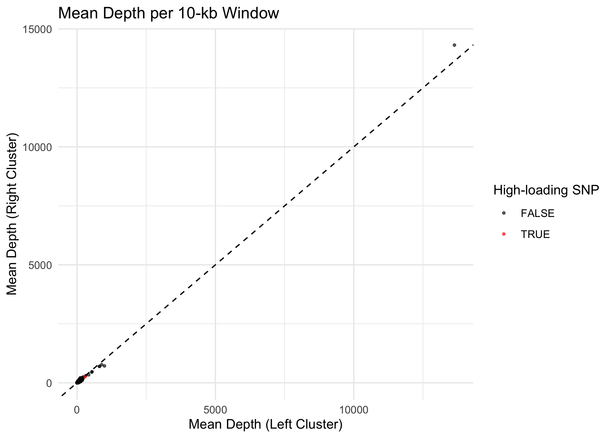

- Next we plot the high loading SNPs only.

``` r
#high loading SNPs
windows_snps <- read_csv("Data/windows_snps.csv")
```

    Rows: 3230 Columns: 3
    ── Column specification ────────────────────────────────────────────────────────
    Delimiter: ","
    chr (1): chr
    dbl (2): start, end

    ℹ Use `spec()` to retrieve the full column specification for this data.
    ℹ Specify the column types or set `show_col_types = FALSE` to quiet this message.

``` r
windows_snps_only <- semi_join(windows_agg, windows_snps, by = c("chr", "start", "end"))

ggplot(windows_snps_only, aes(x = left_cluster_mean, y = right_cluster_mean)) +
  geom_point(color = 'red', alpha = 0.8, size = 1) +
  labs(
    x = "Mean Depth (Left Cluster)",
    y = "Mean Depth (Right Cluster)",
    title = "Mean Depth per 10-kb Window (High-loading SNPs only)"
  ) +
  geom_abline(slope = 1, intercept = 0, linetype = "dashed") +
  theme_minimal()
```

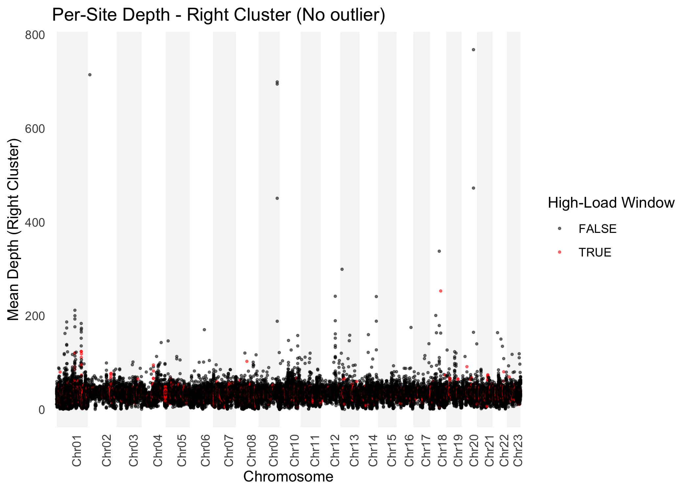

- We can observe one outlier that belongs to Chr02.

To facilitate the visualization of the position of the SNPs across the
genome, we will create Manhattan plots of the per-site mean depth per
cluster, and highlighting in red the high loading windows.

First, the samples in the left cluster (187 samples).

``` r
#Manhattan plots per-site mean depth across the genome poer cluster
#plot all chromosomes/contigs in order
window_lens <- windows_agg %>% group_by(chr) %>% summarise(chr_len = max(end))
chr_offsets <- window_lens %>%
  mutate(offset = cumsum(lag(chr_len, default=0))) %>%
  select(chr, offset)

#1. Annotate each site with genomic coordinate (for plotting)
site_df <- windows_agg %>%
  left_join(chr_offsets, by = "chr") %>%
  mutate(pos_genome = start + offset)

# 2. Compute chromosome boundaries (start, end, center)
chr_boundaries <- site_df %>%
  group_by(chr) %>%
  summarise(chr_start = min(pos_genome, na.rm=TRUE),
            chr_end   = max(pos_genome, na.rm=TRUE),
            chr_center= mean(pos_genome, na.rm=TRUE)) %>%
  arrange(chr) %>%
  mutate(shade_grp = (row_number() %% 2 == 0)) # TRUE/FALSE for alternating color

# 3. Create Manhattan plot with alternating shaded backgrounds for chromosomes

ggplot(site_df, aes(x = pos_genome, y = left_cluster_mean, color = high_loading_window)) +
  # Add rectangles: one for each chromosome, width is start to end
  geom_rect(
    data = chr_boundaries,
    aes(xmin = chr_start, xmax = chr_end, ymin = -Inf, ymax = Inf, fill = shade_grp),
    inherit.aes = FALSE, alpha = 0.1
  ) +
  geom_point(size = 0.5, alpha = 0.7) +
  scale_color_manual(values = c("black", "red"), name = "High-Load Window") +
  scale_fill_manual(values = c("grey70", "white"), guide = "none") +
  scale_x_continuous(
    breaks = chr_boundaries$chr_center,
    labels = chr_boundaries$chr,
    expand = c(0.01, 0.01)
  ) +
  labs(
    x = "Chromosome",
    y = "Mean Depth (Left Cluster)",
    title = "Per-Site Depth - Left Cluster"
  ) +
  theme_minimal() +
  theme(panel.grid.major = element_blank(),
        panel.grid.minor = element_blank(),
        axis.text.x = element_text(angle = 90, hjust = 1))
```


- Again here we can clearly identify that the outlier for the Left
  Cluster corresponds to a window in the Chr20.

We will plot again without this outlier.

``` r
#Wihtout the outlier
ggplot(site_df[site_df$left_cluster_mean < 10000,], aes(x = pos_genome, y = left_cluster_mean, color = high_loading_window)) +
  # Add rectangles: one for each chromosome, width is start to end
  geom_rect(
    data = chr_boundaries,
    aes(xmin = chr_start, xmax = chr_end, ymin = -Inf, ymax = Inf, fill = shade_grp),
    inherit.aes = FALSE, alpha = 0.1
  ) +
  geom_point(size = 0.5, alpha = 0.5) +
  scale_color_manual(values = c("black", "red"), name = "High-Load Window") +
  scale_fill_manual(values = c("grey60", "white"), guide = "none") +
  scale_x_continuous(
    breaks = chr_boundaries$chr_center,
    labels = chr_boundaries$chr,
    expand = c(0.01, 0.01)
  ) +
  labs(
    x = "Chromosome",
    y = "Mean Depth (Left Cluster)",
    title = "Per-Site Depth - Left Cluster (No outlier)"
  ) +
  theme_minimal() +
  theme(panel.grid.major = element_blank(),
        panel.grid.minor = element_blank(),
        axis.text.x = element_text(angle = 90, hjust = 1))
```

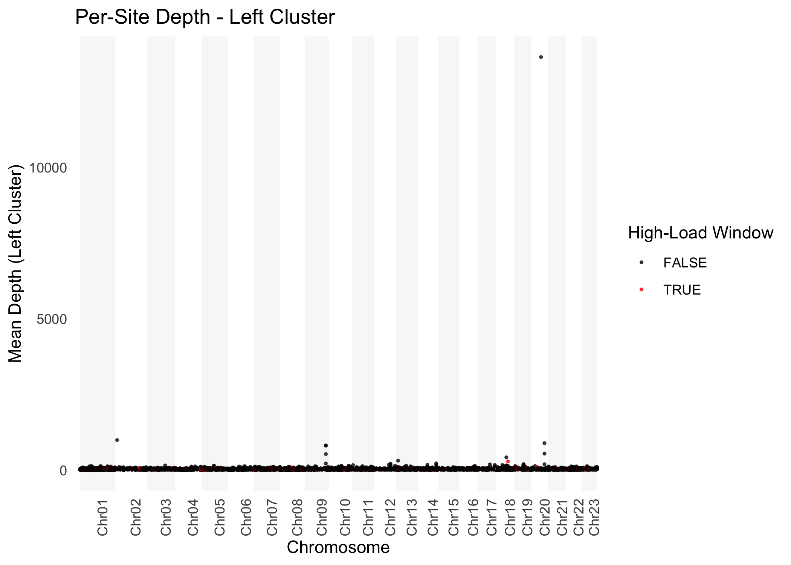

We will do the same for the right cluster (18 samples)

``` r
#Right Cluster

ggplot(site_df, aes(x = pos_genome, y = right_cluster_mean, color = high_loading_window)) +
  # Add rectangles: one for each chromosome, width is start to end
  geom_rect(
    data = chr_boundaries,
    aes(xmin = chr_start, xmax = chr_end, ymin = -Inf, ymax = Inf, fill = shade_grp),
    inherit.aes = FALSE, alpha = 0.1
  ) +
  geom_point(size = 0.5, alpha = 0.7) +
  scale_color_manual(values = c("black", "red"), name = "High-Load Window") +
  scale_fill_manual(values = c("grey70", "white"), guide = "none") +
  scale_x_continuous(
    breaks = chr_boundaries$chr_center,
    labels = chr_boundaries$chr,
    expand = c(0.01, 0.01)
  ) +
  labs(
    x = "Chromosome",
    y = "Mean Depth (Right Cluster)",
    title = "Per-Site Depth - Right Cluster - 18 Indiv"
  ) +
  theme_minimal() +
  theme(panel.grid.major = element_blank(),
        panel.grid.minor = element_blank(),
        axis.text.x = element_text(angle = 90, hjust = 1))
```


Without the outlier

``` r
#Wihtout the outlier
ggplot(site_df[site_df$right_cluster_mean < 10000,], aes(x = pos_genome, y = right_cluster_mean, color = high_loading_window)) +
  # Add rectangles: one for each chromosome, width is start to end
  geom_rect(
    data = chr_boundaries,
    aes(xmin = chr_start, xmax = chr_end, ymin = -Inf, ymax = Inf, fill = shade_grp),
    inherit.aes = FALSE, alpha = 0.1
  ) +
  geom_point(size = 0.5, alpha = 0.5) +
  scale_color_manual(values = c("black", "red"), name = "High-Load Window") +
  scale_fill_manual(values = c("grey60", "white"), guide = "none") +
  scale_x_continuous(
    breaks = chr_boundaries$chr_center,
    labels = chr_boundaries$chr,
    expand = c(0.01, 0.01)
  ) +
  labs(
    x = "Chromosome",
    y = "Mean Depth (Right Cluster)",
    title = "Per-Site Depth - Right Cluster (No outlier)"
  ) +
  theme_minimal() +
  theme(panel.grid.major = element_blank(),
        panel.grid.minor = element_blank(),
        axis.text.x = element_text(angle = 90, hjust = 1))
```

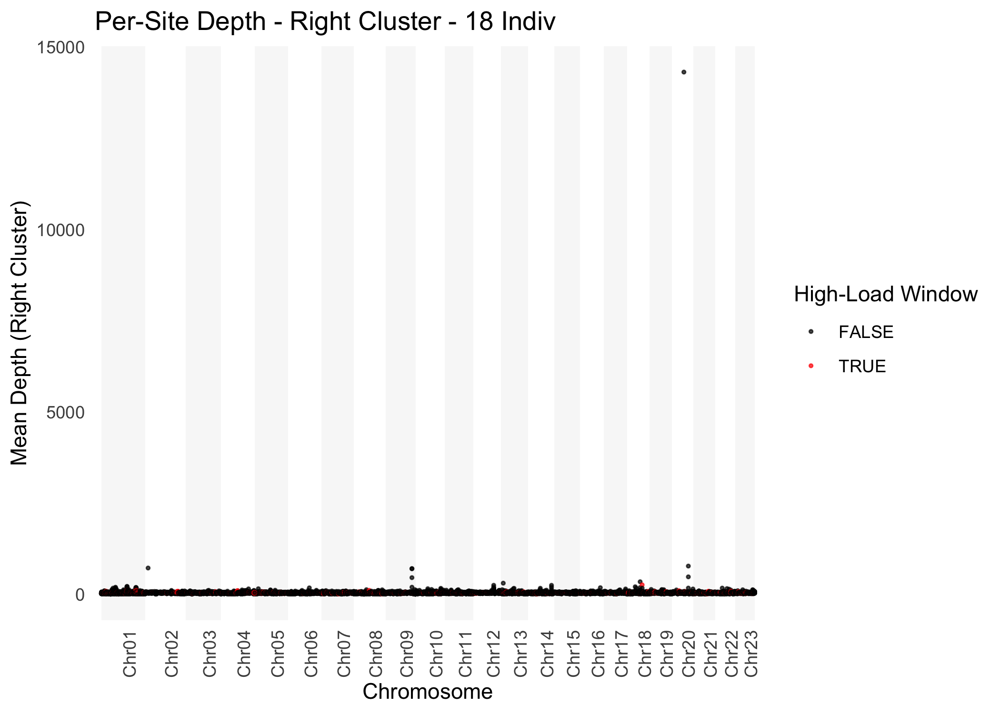
