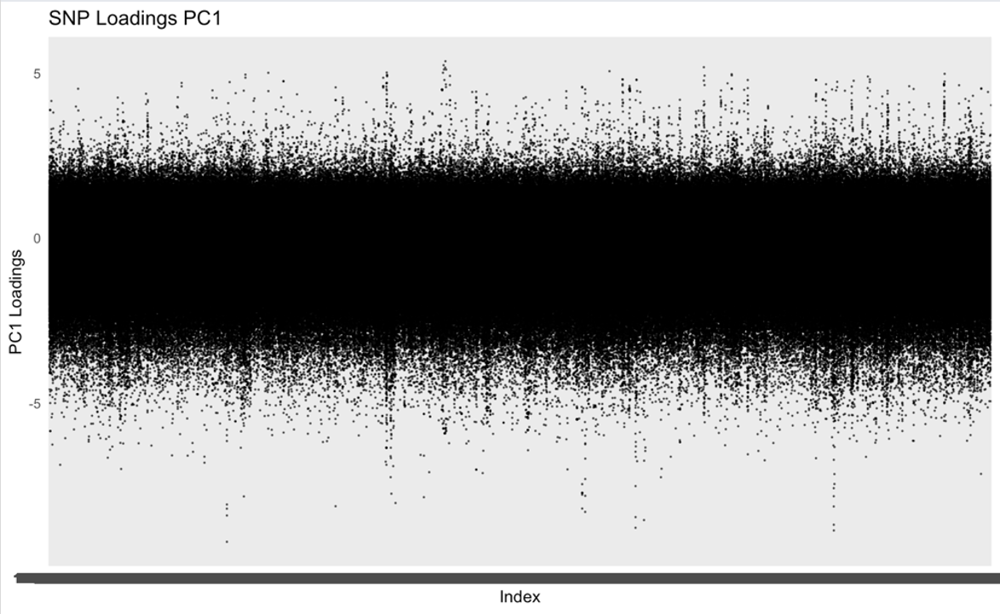
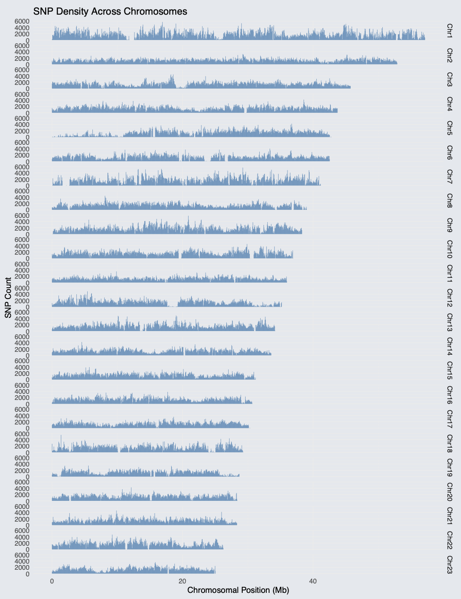
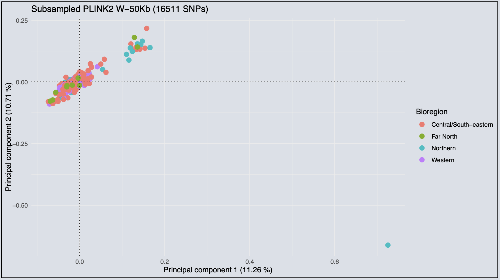

# Sea Cucumber


# Brown Sea Cucumber (*Isostichopus fuscus*) Population Genomics

We have sequenced 210 individuals of *I. fuscus* from various
populations across the different bioregions of the Galapagos Archipelago
(see map).


## 1. SNP calling and PCA

- All 210 samples WGS at ~25x

- Sequence data processed with SnpArcher pipeline

- 88 million SNPs were discovered before any filters were applied.

- The GATK best practices filters (removing all indels, non-biallelic
  SNPs, SNPs with a minor allele frequency \< 0.01, SNPs with \>75%
  missing data, and samples with \<2x sequencing depth) were then
  applied leaving **74180064 SNPs**.

- The approximate nucleotide diversity in the sample using the Watterson
  estimator is 1.3%.

SnpArcher QC analyses revealed two outliers (samples 57 and 127) that
correspond to unique color-morph individuals from the northern region of
the Archipelago (red and black; first record of these color morphs for
the Galapagos). We corroborated species identity of these two outliers
by extracting the COI and BLAST, which called the right species *I.
fuscus* with 99.66% identity.


- After removing the two outlier samples (57 and 127) the PCA plot
  showed three clusters. However these clusters do not follow any
  geographical or environmental pattern. There is a substantial amount
  of genetic variance partitioning among these clusters.

  \`\`\` {#PCA PLINK2 .Bash eval=“False”} \#1 filter samples 57 and 127
  bcftools view -s ^GAL-127,GAL-057
  /home2/jdo53/snpArcher_Projects/snpArcher_New_Assembly/results/final_assembly_23_scaffold/cuc_new_clean_snps.vcf.gz
  -Oz -o filtered_sample57_sample127_snps.vcf.gz

  # Step 2: Convert filtered VCF to PLINK format

  /programs/plink2_linux_avx2_20230721/plink2 –vcf
  filtered_sample57_sample127_snps.vcf.gz –allow-extra-chr –autosome-num
  95 –make-bed –set-all-var-ids @:# –out
  filtered_sample57_sample127_polymorphic_snp_data

  # Step 3: Remove duplicate variant IDs

  /programs/plink2_linux_avx2_20230721/plink2 –bfile
  /home2/jdo53/New_Assembly/PLINK2/filtered_sample57_sample127_polymorphic_snp_data  
  –allow-extra-chr –autosome-num 95  
  –rm-dup force-first  
  –make-bed  
  –out filtered_sample57_sample127_polymorphic_snp_data_dedup

  # Step 5: Perform linkage pruning on the filtered dataset

  # This removes SNPs in linkage disequilibrium (LD) \#updated prunning details

  /programs/plink2_linux_avx2_20230721/plink2 –bfile
  filtered_sample57_sample127_polymorphic_snp_data_dedup  
  –allow-extra-chr –autosome-num 95  
  –indep-pairwise 20 5 0.1  
  –out LD_pruning_results

  # Step 6: Extract only the pruned SNPs and perform PCA

  /programs/plink2_linux_avx2_20230721/plink2  
  –bfile filtered_sample57_sample127_polymorphic_snp_data_dedup  
  –extract LD_pruning_results.prune.in  
  –make-bed  
  –allow-extra-chr –autosome-num 95  
  –out filtered_sample57_sample127_LDpruned

  /programs/plink2_linux_avx2_20230721/plink2  
  –bfile filtered_sample57_sample127_LDpruned  
  –allow-extra-chr –autosome-num 95  
  –pca allele-wts  
  –out final_pca_resultsLD_20_5_01 \`\`\`


- H: This pattern could be driven by sex determination loci.

- PCA per chromosome do not show a desirnable pattern either (plots in
  folder: PCA_Chroms).

- PCA analysis per Island also show similar clustering pattern of the
  global PCA (3 clusters).


## 2. PCA Loadings

- Strong loadings in many different chromosomes and concentrated across
  various chromosomes (genome wide effect)

- The first plot shows the raw loadings, and the second plot shows the
  Squared loadings. To facilitate the visualization, the second plot
  contain only the top 0.1% SNPs, and the 100 top-ranked SNPs are
  colored in red. The loadings were calculated using PLINK2 with the
  following settings –indep-pairwise 50 10 0.1 and I filtered out the
  outlier samples (57 and 127).

  

  ``` r
  ######Squared loadings#####
  # Read SNP loadings
  # snp_loadings <- fread("./Data/final_pca_results.eigenvec.allele", header = TRUE) |> 
  #     select(`#CHROM`,ID,PC1,PC2) |> 
  #     mutate(PC1_sqrd = PC1^2, 
  #            PC2_sqrd = PC2^2)


  ######PC1 ########
  # Rank SNPs by squared loading and identify top 0.1% and top 100
  # pc1_data <- snp_loadings %>%
  #     arrange(desc(PC1_sqrd)) %>%
  #     mutate(
  #         Rank = row_number(),
  #         Top_0_1_Percent = ifelse(Rank <= ceiling(0.001 * n()), TRUE, FALSE),
  #         Top_100 = ifelse(Rank <= 100, TRUE, FALSE)
  #     )
  # 
  # pc1_data <-pc1_data |> 
  #     mutate(Chrom = str_extract(`#CHROM`, "Chr\\d+")) |> 
  #     mutate(ID = str_extract(ID, "(?<=:)\\d+$"))


  # Filter for top-ranked SNPs (top 0.1%)
  # top_snps_1 <- pc1_data  |>  filter(Top_0_1_Percent)
  # 
  # write_csv(top_snps_1, "./Data/top_snps_1.csv")


  top_snps_1 <- read_csv("./Data/top_snps_1.csv")
  ```

      Rows: 8904 Columns: 10
      ── Column specification ────────────────────────────────────────────────────────
      Delimiter: ","
      chr (2): #CHROM, Chrom
      dbl (6): ID, PC1, PC2, PC1_sqrd, PC2_sqrd, Rank
      lgl (2): Top_0_1_Percent, Top_100

      ℹ Use `spec()` to retrieve the full column specification for this data.
      ℹ Specify the column types or set `show_col_types = FALSE` to quiet this message.

  ``` r
  # Prepare the data for nice plot

  data <- top_snps_1 %>%
    # Convert chromosome positions to numeric
    mutate(
      pos = as.numeric(ID),
      # Extract chromosome number as numeric
      Chrom_num = as.numeric(str_extract(Chrom, "\\d+"))
    ) %>%
    # Calculate cumulative positions for x-axis
    arrange(Chrom_num, pos) %>%
    group_by(Chrom) %>%
    mutate(
      # Create chromosome-specific positions
      chr_len = max(pos),
      # Add chromosome color grouping
      chr_color = ifelse(Chrom_num %% 2 == 0, "gray", "black")
    ) %>%
    # Calculate cumulative position
    ungroup() %>%
    mutate(
      bp_cum = pos + lag(cumsum(chr_len), default = 0)
    )

  # Calculate chromosome middle positions for x-axis labels
  axis_df <- data %>%
      group_by(Chrom) %>%
      summarize(center = mean(bp_cum))

  # Create Manhattan plot
  ggplot(data, aes(x = bp_cum, y = PC1_sqrd)) +
      # Add all points
      geom_point(aes(color = chr_color), size = 1, alpha = 0.8) +
      # Add top SNPs in red
      geom_point(data = subset(data, Top_100), color = "red", size = 1) +
      # Set colors for chromosomes
      scale_color_manual(values = c("black", "gray")) +
      # Set x-axis labels
      scale_x_continuous(label = axis_df$Chrom, breaks = axis_df$center) +
      #scale_y_continuous(limits = c(0.6, 1.0)) +
      # Customize theme
      theme_minimal() +
      theme(
          panel.grid.major = element_blank(),
          panel.grid.minor = element_blank(),
          legend.position = "none",
          axis.text.x = element_text(size = 8, angle = 90),
          axis.title = element_text(size = 10)
      ) +
      # Add labels
      labs(title = "Manhattan Plot of Squared Loadings (PC1)",
          x = "Chromosomes",
          y = expression(Squared ~ loadings ~ rho[j]^2)
      )
  ```

  

  ## 

  3.  SNP density per Chromosome (50Kb windows)

  

## 4. SNP prunning

- Bcftools does a genome-wide pruning with 50kb windows and keeps a
  random SNP. Heavily reduced the number of SNPs, initial clustering
  pattern disappears.

  

- PLINK2 prunes on each chromosome and maintains an SNP even if the
  chromosome is smaller than 50Kb. More SNPs maintain cluster pattern.

  

## 5. LcWGS

- To check for library prep errors, we selected a subset of samples to
  perform LcWGS. PCA plots show similar clustering pattern, confirming
  that WGS library prep was not contaminated.

  

## 6. LD Analysis

- Genome-wide LD analysis. LD was calculated for 0.1% of the top-loading
  SNPs (N = 7049).


- Strong LD is observed among the SNPs on each chromosome.

- The cross-chromosome LD observed in high-loading SNPs is higher than
  random genome-wide background


# 7. Observed Heterozygosity

``` r
#Pop info = Cluster from Global PCA (Left, Center, Right)
pop_info <- fread("Data/sample_population_info.txt")


# Load data
geno <- read.table("Data/HighLoad_01pct_genotypes.tsv", header=F, stringsAsFactors=FALSE) 
colnames(geno) <- c("CHROM", "POS", as.character(pop_info$ID))
geno <- geno |> 
    mutate(CHROM = str_extract(CHROM, '^[^_]+'))


# Reshape to long format
geno_long <- geno %>%
    pivot_longer(
        cols = -c(CHROM, POS),
        names_to = "ID",
        values_to = "GT"
    )

# Join population info
geno_long <- geno_long %>% left_join(pop_info, by = "ID")

# Define heterozygous genotypes
is_het <- function(gt) grepl("0[|/]1|1[|/]0", gt)
geno_long$HET <- sapply(geno_long$GT, is_het)

# Calculate per-individual heterozygosity
ind_het <- geno_long %>%
    group_by(ID, Cluster) %>%
    summarise(multi_locus_het = mean(HET, na.rm=TRUE), .groups = "drop")

#write_csv(ind_het,"ind_het.csv")

ggplot(ind_het, aes(x = Cluster, y = multi_locus_het, fill = Cluster)) +
    geom_boxplot(outlier.shape = NA, alpha = 0.7) +
    geom_jitter(width = 0.2, size = 2, alpha = 0.7) +
    theme_minimal(base_size = 14) +
    labs(
        title = "Individual Multi-locus Heterozygosity by Cluster",
        x = "Cluster",
        y = "Multi-locus heterozygosity"
    ) +
    theme(
        axis.text.x = element_text(angle = 45, hjust = 1),
        legend.position = "none"
    )
```


- Results for the observed heterozygosity at each cluster for the
  high-loading SNPs, shows the highest heterozygosity observed in the
  central cluster (possibly hermaphrodites) . Which, in case the
  sex-driven hypothesis is true, aligns well with the logic that high
  heterozygosity levels reflect the need to maintain genetic variation
  for both male and female reproductive functions.

### 7.1 Per SNP-Heterozygosity difference between Left and Right clusters

``` r
# Calculate per-site heterozygosity for each cluster
het_by_cluster <- geno_long %>%
    group_by(CHROM, POS, Cluster) %>%
    summarise(
        HET = sum(HET, na.rm = TRUE) / sum(!is.na(GT) & GT != "./." & GT != ".", na.rm = TRUE),
        .groups = "drop"
    )


#Convert to wide format so each row is a SNP and each cluster is a column:
    
het_wide <- het_by_cluster %>%
    pivot_wider(names_from = Cluster, values_from = HET)

# Calculate difference (e.g., left - right)
het_wide <- het_wide %>%
    mutate(diff_left_right = LEFT - RIGHT)

ggplot(het_wide, aes(x = POS, y = diff_left_right)) +
    geom_point(aes(color = diff_left_right < 0), size = 0.5, alpha = 0.7) +
    facet_wrap(~CHROM, scales = "free_x") +
    geom_hline(yintercept = 0, linetype = "dotted", color = "red") +
    scale_color_manual(values = c("black", "blue"), guide = "none") +
    labs(
        x = "Genomic Position",
        y = "Heterozygosity Difference",
        title = "Per-Site Heterozygosity Difference (Left - Right) by Chromosome"
    ) +
    theme_bw() +
    theme(axis.text.x = element_text(size = 5))
```


- Results show that the right cluster has more heterozygous SNPs than
  the left cluster.

``` r
# Remove rows with NA in left or right
het_wide_filtered <- het_wide %>% filter(!is.na(LEFT) & !is.na(RIGHT))

# Scatter plot: left vs right cluster heterozygosity, faceted by chromosome
ggplot(het_wide_filtered, aes(x = LEFT, y = RIGHT)) +
  geom_point(alpha = 0.5, size = 0.7) +
  facet_wrap(~CHROM) +
  geom_abline(slope = 1, intercept = 0, linetype = "dashed", color = "red") +
  scale_x_continuous(limits = c(0, 1)) +
  scale_y_continuous(limits = c(0, 1)) +
  #coord_fixed(ratio = 1) +
  labs(
    x = "Per-SNP Heterozygosity in Left Cluster",
    y = "Per-SNP Heterozygosity in Right Cluster",
    title = "Per-SNP Heterozygosity: Left vs Right Cluster by Chromosome"
  ) +
  theme_bw()
```


- Chromosomes 6 and 9 show distinct patterns.
